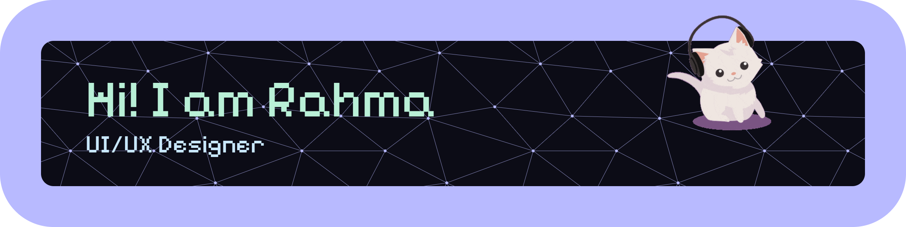

## Hi there, I'm Rahma Sarita Nasution 👋

<!-- <!--
**raasrtaa/raasrtaa** is a ✨ _special_ ✨ repository because its `README.md` (this file) appears on your GitHub profile. -->

### :link: Connect with Me

  
  
  

### &#10024; About Me
I'm an **Information Technology student** at the University of North Sumatra 🎓. I have a deep interest in **UI/UX Design** and I'm currently on a journey to becoming a **Professional Programmer**. When I'm not coding, you'll find me watching movies or listening to some chill music. 🎧

- :ocean: **Interest:** UI/UX Design & Artificial Intelligence.
- :clapper: **Favorite Movie:** *Dead Poets Society* (O Captain! My Captain! &#128153;).
- :headphones: **Vibe:** Chill R&B — Big fan of **lngshot**!
- :bread: **Daily Habit:** Chocolate milk and bread for breakfast.

### :hammer_and_wrench: Tech Stack & Tools

  

### :bar_chart: GitHub Stats

  
  

###

  
  

<picture>
  <source media="(prefers-color-scheme: dark)" srcset="https://raw.githubusercontent.com/raasrtaa/raasrtaa/output/pacman-contribution-graph-dark.svg">
  <source media="(prefers-color-scheme: light)" srcset="https://raw.githubusercontent.com/raasrtaa/raasrtaa/output/pacman-contribution-graph.svg">
  
</picture>

###

###

### 🎧 On My Playlist 

  

  

  

  

  
<i>Current mood</i>

